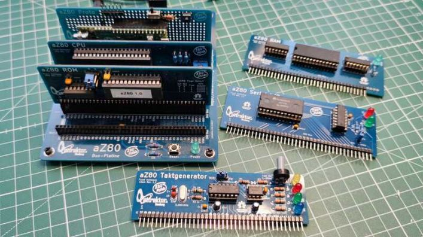

# aZ80 Hardware

#### Aus welchen Komponenten besteht das aZ80 System?

Über eine zentrale Verbindungsplatine (aZ80 Bus) werden die Prozessorplatine (aZ80 CPU),
der Festwertspeicher (aZ80 ROM), der Zugriffspeicher (aZ80 RAM), die Taktplatine (aZ80 Clock),
der serielle Controller (aZ80 Serial), die Ein- und Ausgabeplatine (aZ80 DIO) und weitere Platinen,
miteinander verbunden. Der 40 Pin breite Bus des aZ80 enthält die wichtigsten Signale um diese 
Komponenten miteinander zu verbinden. Weitere Infos und Produktionsdaten findet man im jeweiligen
Unterordner.

### Speicher und I/O Adressen

#### ROM:  $0000 - $3FFF
|  Addresse  | Verwendung |
| ----------:|:-----------|
| $0000 | RST Vectors und System Funktionen |
| $0070 | BIOS |
| $0200 | BASIC |
| $2000 | MONITOR |
|   |   |
| $4000 - $7FFF	| Expansion ROM or VideoRAM 16K (preliminary) |

#### RAM:  $8000 - $FFFF
|  Addresse  | Verwendung |
| ----------:|:-----------|
| $8000 - $80FF | System Variables (Zero Page) |
|   $8000 | Serial Buffer  size $3F |
|   $8040 | Serial In Pointer  size 2 |
|   $8042 | Serial Rd Pointer  size 2 |
|   $8044 | Serial Buffer Used	size 2 |
|   $8046 | Basic Started?  size 1 |
| Init: | | 
|   $80ED | Temp Stack |			
| Basic: | |
|   $8047 | Workspace Start (see Basic) |
|   $81A3 | Basic Memory Start |
| Monitor: | |
|   $8047 | Workspace Start (see Monitor) |
| | |
| $8100 - $FFFF	| Stack + User Memory |

#### I/O Map
|  I/O Addresse  | Verwendung |
| -------------:|:-----------|
| $00-$0F	| Digital I/O 00000000 - 0000xx11  (preliminary) |
| $10-$1F	| IDE/CF  I/O 0001xx00 - 0001xx11  (preliminary) |
| $80-$81	| Serial  I/O 10xxxxx0 - 10xxxxx1  (addr decoder verbrät viele Addressen) |
| $C0-$CF	| Video   I/O 1100xx00 - 1100xx11  (preliminary) |
| $D0-$DF	| Audio   I/O 1101xx00 - 1101xx11  (preliminary) |

#### RST Vectors
|  Reset Vector | Verwendung |
| -------------:|:-----------|
| RST00		| $0000	Reset Vector |
| RST08		| $0008	TX Char - Sende Zeichen über seriellen Port |
| RST10		| $0010	RX Char - Empfange Zeichen über seriellen Port | 
| RST18		| $0018	Check Char - Überprüfe ob Zeichen eingegangen sind |
| RST20		| $0020	- |
| RST28		| $0028	- |
| RST30		| $0030	- |
| RST38		| $0038	INT Vector - |
