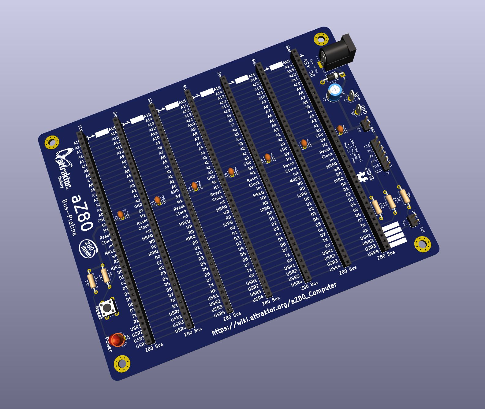

# aZ80 Bus-Platine

Die Bus-Platine bildet das Rückgrat unseres Computers. Sie verbindet die einzelnen Karten des aZ80 miteinander.

Die sieben Slots sind alle gleich belegt und leiten den Adress- und Datenbus sowie die Kontrollsignale und die Versorgungsspannung weiter an die verschiedenen Karten.

Die LED D2 zeigt an, dass eine Versorgungsspannung anliegt.

Der Taster SW1 erlaubt das Zurücksetzen und Neustarten des Computers, der sogenannte RESET. Dies ist hilfreich, wenn der aZ80 mal nicht mehr reagieren sollte.

Im Kurs zeigen wir euch, wie man diese Platinen am besten zusammen lötet.

Externe Anschlüsse:

 - J1 - Steckleiste für Serielles Interfaces (FTDI Belegung)
 - J2 - Buchse für die externe 5V Versorgungsspannung (Barrel-Jack, Mitte +5V)
 - J3 - +5V Messpunkt für die Versorgungsspannung.
 - J4 - Masse Messpunkt für die Versorgungsspannung.

Steckbrücken (Jumper):

 - JP1 - Steuerleitung RTS des FTDI USB Seriell Wandlers mit Leitung USR1 verbinden
 - JP2 - Stromversorgung per FTDI USB Seriell Wandler erlauben

Unser aZ80 Computer benötigt eine +5V Versorgungsspannung von etwa 300mA, was einen Betrieb über den FTDI USB Seriell Wandler erlaubt, wenn nicht noch weitere Zusatzkarten (Video, Audio usw.) eingesteckt sind. In diesem Falle sollte man über die Buchse J2 ein USB-Netzteil anschließen.

Der BUS ist größtenteils kompatibel mit dem sogenannten RC40 System (Retro Computer 40), dass auch im RC2014 Computer benutzt wird. Hierzu gibt es diverse Erweiterungsplatinen, die auch zum großen Teil mit dem aZ80 kompatibel sind.

Pin-Belegung der aZ80 Busses
----------------------------------
-  1 - 16  A15-A0 	Adress-Bus 
-    17  GND		Masse
-    18  VCC +5V	Versorgungsspannung
-    19  M1		Steuerungssignal
-    20  RESET		Zurücksetzen des Systems
-    21  CLOCK		Taktsignal 3,68MHz
-    22  INT		Interrupt, Unterbrechungsanforderung
-    23  MREQ		Memory Request, Speicheranfrage
-    24  WR		Write, Daten schreiben
-    25  RD		Read, Daten lesen
-    26  IORQ		I/O Request, I/O-Anfrage
- 27 - 34  D0-D7		Daten-Bus
-    35  TX		Serielle Daten Senden
-    36  RX		Serielle Daten Empfangen
- 37 - 40  USR1-USR4	Benutzerdefinierte Signale  

Der Adress- und Daten-Bus ermöglicht dem Prozessor/CPU mit den einzelnen Karten Daten auszutauschen. Dabei enthält der Adress-Bus, wenn man so will, die Adresse eines Postfachs in das man was reinlegen oder rausholen möchte. Der Daten-Bus enthält die Information die dort gelesen wurde oder abgelegt werden soll.

Mit den Steuersignale (RD, WR, MREQ, IORQ, M1) legt der Prozessor fest, wie und von wo etwas gelesen oder geschrieben werden soll.   

Benutzerdefinierte Signale USR1-USR4:
-----------------------------------------

Die vier USR1-USR4 Pins kann man selber nach Bedarf belegen. Die Serielle Karte kann z.B. über die Steuerleitung USR1 mit dem FTDI Seriell Wandler verbunden werden, was eine Flusssteuerung der Daten erlaubt. Dies ist nötig, wenn unser aZ80 lange BASIC Programme empfangen und nichts verloren gehen soll.
