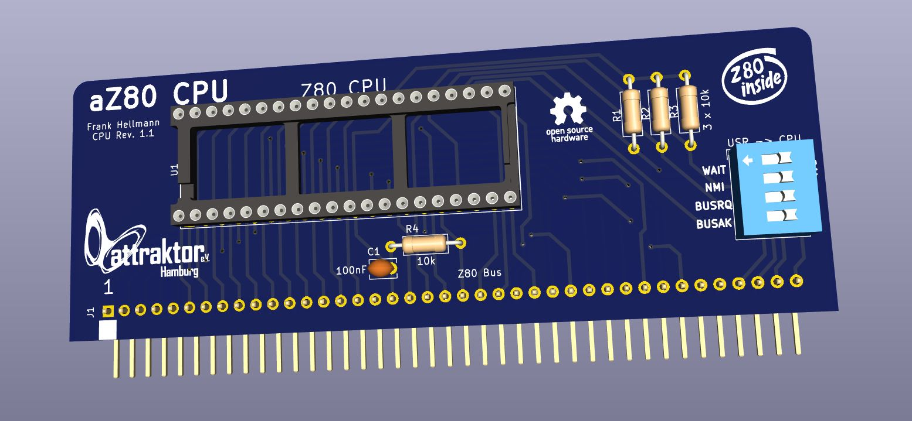

# aZ80 CPU Platine

Die CPU Platine ist das Hirn des aZ80 Retro Computers und verarbeitet die Daten.

#### Switch USR -> CPU

Der Switch ist normalerweise in allen Positionen auf Off gestellt.

 - 1 - WAIT 
 - 2 - NMI
 - 3 - BUSRQ
 - 4 - BUSACK

Das WAIT Signal hält die CPU an und wird aktuell nur beim Betrieb der SN76489 Soundkarte genutzt. Diese ist so langsam, dass sie die CPU anhalten muss, bis der nächste Befehl gesendet werden darf.
Das NMI (Non-Maskable-Interrupt) Signal ist aktuell ungenutzt.
Das BUSRQ (Bus-Request) Signal ist aktuell ungenutzt.
Das BUSACK (Bus-Acknowledge) Signal ist aktuell ungenutzt.
