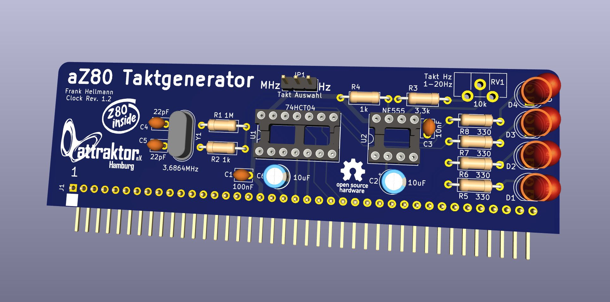

# aZ80 Taktgenerator Platine

Die Taktgenerator Platine gibt den Takt des aZ80 Retro Computers vor und synchronisiert alle Karten.

Es gibt zwei Modis die mit dem Jumper JP1 umgestellt werden können:

 - 1 - Volle Geschwindigkeit mit 3.6864 MHz
 - 2 - Langsame Geschwindigkeit mit 4-20Hz

Im Normalfall läuft das aZ80 Retro System mit vollem 3.6864Mhz Takt, welcher auch die serielle Baudrate von 57.600 Baud vorgibt.

Bei der langsamen Geschwindigkeit kann man dem System besser "auf den Zahn fühlen", z.B. mit einem Logic Analyser oder der Digital I/O Karte, hat aber keine serielle Verbindung mehr.
Das Poti RV1 erlaubt das Einstellen der Geschwindigkeit im Rahmen von ca. 4 bis 20 Herz.

Die Status LEDs zeigen an, was auf dem aZ80 Bus so los ist:

 - RD - Es wird auf dem Bus etwas gelesen
 - WR - Es wird auf dem Bus etwas geschrieben
 - INT - Es ist ein Interrupt ausgelöst worden
 - CLK - Hier wird der aktuelle Takt als Blinken angezeigt
