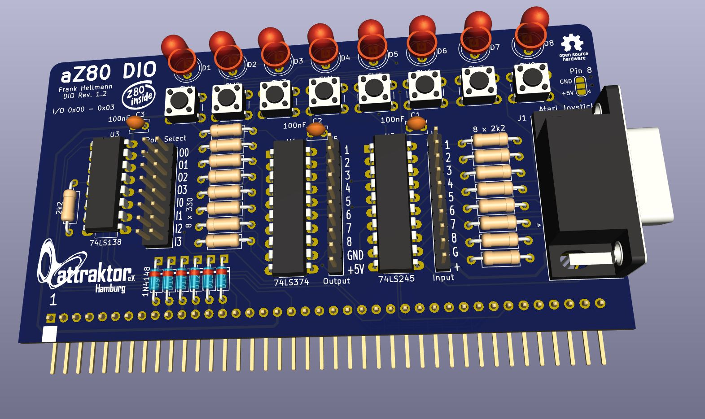

# aZ80 Digital I/O Platine



Die DIO (Digital I/O) Platine stellt über Taster, Joystick Anschluss und LEDs eine Verbindung zur Aussenwelt her.

#### Port Auswahl

Über den Jumperblock JP1 kann die Adresse (Port) eingestellt werden, auf den die DIO Platine reagieren soll. 
Normalerweise ist dort O0 und I0 gesteckt, was bedeutet, dass die DIO Platine auf Addresse 0 beim Lesen und Schreiben reagiert.
Damit können auch mehrere Karten in einem aZ80 System genutzt werden, wenn alle Karten unterschiedliche Addressen bekommen.

#### LEDs

Die LEDs können über die eingestellte Addresse mit einem I/O Write eingeschaltet werden. 

```
Basic:   OUT 0, 170             schaltet jede zweite LED an Port 0 an.

ASM:     LD      A,%10101010
         OUT     IOPORT,A       schaltet jede zweite LED an Port 0 an.
```

#### Taster & Joystick

Die Taster und der Joystick können über die eingestellte Addresse mit einem I/O Read ausgelesen werden.

```
Basic:   A$=INP(0)     liest den Status der Taster in A$ ein

ASM:     IN A,(0)      liest den Status der Taster in Register A
```

#### Basic Beispiel um LED mit Button einzuschalten

```
10 OUT 0,INP(0)
20 GOTO 10
```
