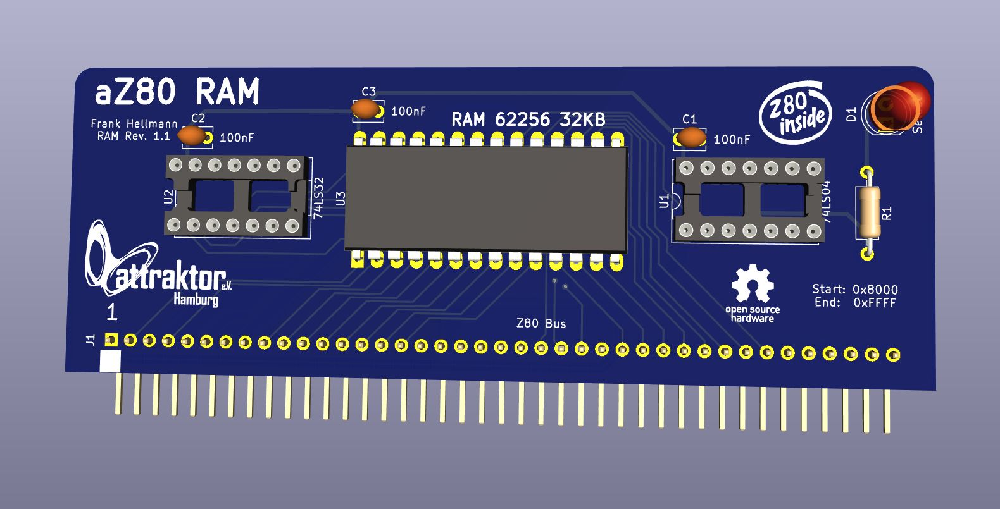

# aZ80 RAM Platine

Die RAM Platine stellt den 32KB großen flüchtigen Arbeitsspeicher dem aZ80 Retro System zur Verfügung.

Das RAM wird im oberen Teil des Addressraums eingeblendet ($8000-$FFFF).

Die LED zeigt einen Zugriff auf den Arbeitsspeicher an.
