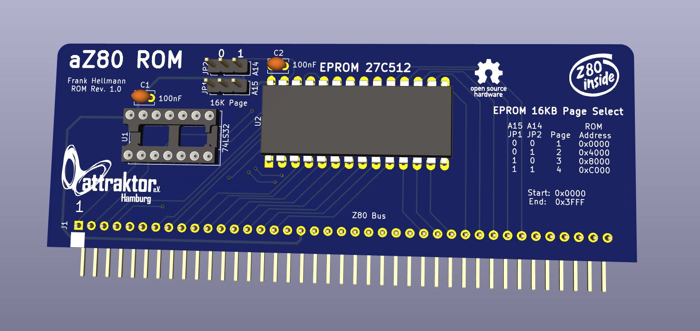

# aZ80 ROM Platine

Die ROM Platine stellt dem aZ80 Retro System den nichtflüchtigen Speicher zur Verfügung. 

Der 32KB große Speicherbaustein (EEPROM) ist in 4 8KB große Teile (Bänke/Pages) aufgeteilt.

#### Bank Auswahl

Über die Jumper JP1 und JP2 kann der Teil des ROMs eingestellt werden, der dem aZ80 zur Verfügung gestellt werden soll.

| JP2 | JP1 | Bank |
|:---:|:---:|:-----|
| 0 | 0 | 1 - BIOS mit BASIC und MONITOR |
| 0 | 1 | 2 - Diagnostic ROM |
| 1 | 0 | (aktuell Kopie von Bank 1) |
| 1 | 1 | (aktuell Kopie von Bank 2) |
