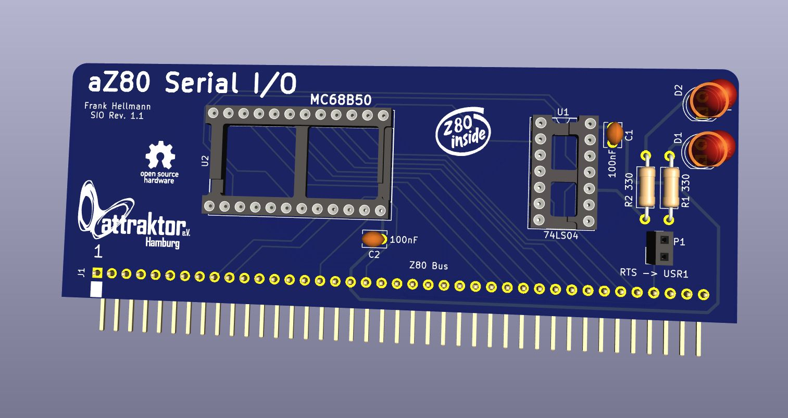

# aZ80 Serielle Platine

Die serielle Platine stellt über eine serielle Schnittstelle die Verbindung zur Aussenwelt her. 
Diese Schnittstelle wird über die Busplatine an deren Anschluß J1 zur Verfügung gestellt. 
Dort kann man dann ein seriell zu USB Wandlerkabel anschließen und mit einem Computer als Terminal Ersatz verbinden. 
Hierbei ist auf die Pinbelegung zu achten, da diese nicht wirklich genormt ist.

Über den Jumper JP1 kann ein RTS/CTS-Handshaking aktiviert werden, was wichtig ist, wenn man viele Daten oder lange 
Listings vom Computer übertragen will. Das Handshaking stellt sicher, dass nur dann Daten übertragen werden, wenn 
das aZ80 System diese auch verarbeiten kann und noch Platz im Empfangsbuffer ist.

Die Einstellungen in einem seriellen Terminal Emulator auf einem PC sind dann folgende:

    57600 Baud  8-N-1  RTS/CTS Handshake

#### LEDs

Die LEDs zeigen den Datentransfer über die Sende- (TX) und Empfangs- (RX) Leitung an.

#### Jumper JP1

Der Jumper JP1 erlaubt das Aktivieren des RTS/CTS-Handshaking über die USR1 Leitung zur Busplatine. 
Dort muß auch der Jumper JP1 gesteckt werden um das Signal an den Anschluß J1 weiterzuleiten.

#### Baudrate

Die Baudrate wird direkt aus dem Systemtakt der Clock Platine abgeleitet und beträgt im Normallfall 57600 Baud, wenn ein 3.6864MHz Quartz verwendet wird.

Wenn die Clock Platine auf niedrige Frequenz (4-20Hz) steht, dann funktioniert die Serielle Karte nicht ordnungsgemäß.
