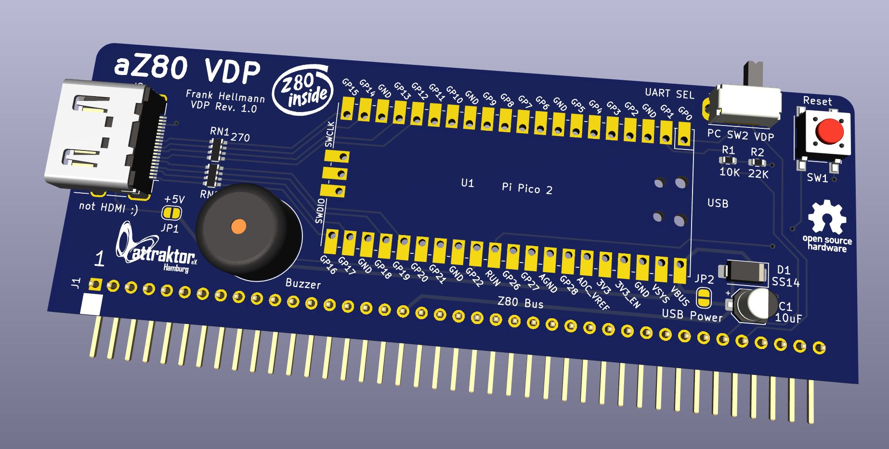

# aZ80 VDP Platine

Die Video-Display-Processor VDP Platine ist eine Grafik- und I/O-Karte mit eingebautem Terminal Emulator. Über die serielle Schnittstelle kann sie Daten vom aZ80 System
entgegennehmen und anzeigen, kann aber auch über den USB Port Eingaben über eine USB-Tastatur an das aZ80 System weitergeben. 
Auch andere USB-Geräte, wie Maus, Joystick oder Speicherstick können abgefragt werden, wobei die Unterstützung noch work in progress ist.

Der VDP untertützt die normale Anzeige von Text, der über die seriellen Schnittstelle eingeht. Darüber hinaus werden auch ANSI Kontrollzeichen 
unterstützt, welche eine erweiterte Kontrolle der Textattribute, wie Farbe, Blinken, Position usw. erlaubt, darüber hinaus auch eine Grafikausgaben
und die Kontrolle von Sprites, Maus-Cursor und den Buzzer erlaubt. Weiteres auf der ANSI Seite.

Über die USB-Tastatur kann mit der Tastenkombination WIN+ESC ein Debug-Fenster eingeblendet werden, das den akutellen Zustand des VDP anzeigt.

#### Technische Daten

Der VDP bietet eine Grafikauflösung von 320x240 Pixel mit 256 Farben. Die Ausgabe erfolgt hochskaliert als 640x480 Pixel Modus mit 60Hz über eine (not) HDMI Schnittstelle.

 - 320x240 Pixel Auflösung
 - 40x24 Zeichen Textmodus mit 16 bzw. 256 Farben
 - 256 Farben Palette mit 16bit Farbtiefe, 8 Farben in automatischer Farbrotation
 - 64 32x32 Pixel Sprites mit 256 Farben und Maskenkanal
 - einen Mauscursor
 - einfache Text- und Grafik-Kommandos
 - Double-Buffered Text-, Grafik und Sprite-Aufbau für flickerfreie Anzeige mit 60Hz
