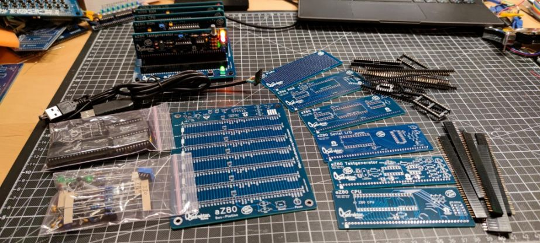
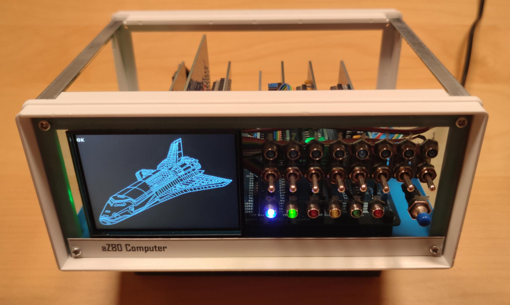

# aZ80_Computer

#### Was ist der aZ80 Retro Computer?

Die Idee war: Wir bauen einen kleinen bezahlbaren Retro Computer für Workshops im Attraktor e.V.

 - Mit Steckkarten, damit man ihn erweitern kann. 
 - Beim Aufbau jeder Karte gibt es einen Einblick, was diese im Detail macht und wie sie funktioniert
 - Eine Einführung zur Computertechnik der 70er Jahre und die Gedankengänge und Evolutionen, die es zu der Zeit gab.
 - Wir programmieren auf dem aZ80 mit MS-BASIC und Assembler, z.B. kleine Spiele und Programme.

Unter Docs findet sich eine erste Präsentation über das Projekt. Eine ausführliche Anleitung folgt nach den ersten Workshops.

#### Hardware

Die Entscheidung was für ein System ich "neu" entwickeln wollte, fiel auf einen Bauvorschlag von <a href="http://searle.wales/">Grant Searle</a>, 
der auch bei einigen anderen Retro-Computern (RC2014) zum Einsatz kam. Damit gibt es eine gewisse 
Kompatibilität zum RC2014 System und den Steckkarten, aber der aZ80 sollte als Open-Hardware und -Software verfügbar 
sein und nicht hinter einer Paywall liegen, teure Kits oder Zusatz Hardware benötigen, z.B. wie der RC2014.

#### Software

Für den aZ80 wurden eine alte Version von MS Basic (Nascom Basic 4.7) und der Efex Monitor (Efex V4 1.0) mit einem eigenen BIOS kombiniert.
Das BIOS checkt, ob die wichtigsten Karten des Systems funktionieren und initialisiert diese. Danach erscheint über die serielle Schnittstelle
die Auswahlmöglichkeit zwischen dem Basic und dem Monitor Programm. Diese sind so angepasst, dass sie mit dem 
Online Z80 Compiler <a href="https://www.asm80.com/">ASM80</a> bearbeitet werden können.

Nascom Basic Verweis: <a href="https://gitlab.com/feilipu/NASCOM_BASIC"> https://gitlab.com/feilipu/NASCOM_BASIC </a>

Efex V4 1.0 Verweis: <a href="https://mkpeker.wixsite.com/efex"> https://mkpeker.wixsite.com/efex </a>

#### VDP

Als Highlight hat der aZ80 ein Video Display Prozessor mit an Board, der die Verbindung in die jetzige Zeit herstellt. Mit dieser Karte kann man den aZ80
an einen DVI/HDMI Monitor anschließe, und per USB auch Tastatur, Maus, Joystick und/oder Speicher anschließen. Das kombiniert mit einem schicken Gehäuse
mit eingebautem Display gibt dann einen kleinen feinen Standalone Z80 Computer.

Der VDP wird über die serielle Schnittstelle angesprochen und kann Text 40x25 Zeichen oder auch Grafiken (320x240 Pixel mit 256 Farben), Sprites oder 
einen Mouse Cursor anzeigen. Zusätzlich gibt es einen Debug Bildschirm, mit dem man den aktuellen Status sich anzeigen lassen kann (Win+ESC Taste).

